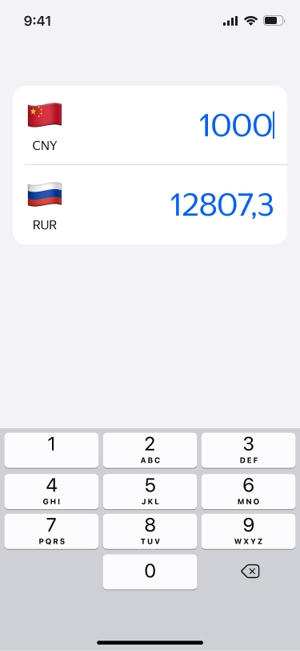
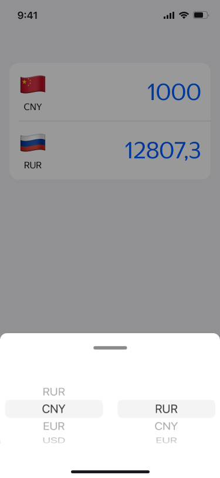
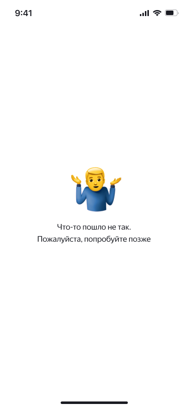

# Приложение «MoexCalculator»

MoexCalculator - приложение на SwiftUI. Получает текущие котировки валют от МосБиржи, отображает их в виде списка и конвертирует валюту в рубли.

    <kbd>
      
      &nbsp;
      
      &nbsp;
        
    </kbd>

